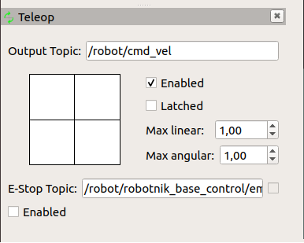
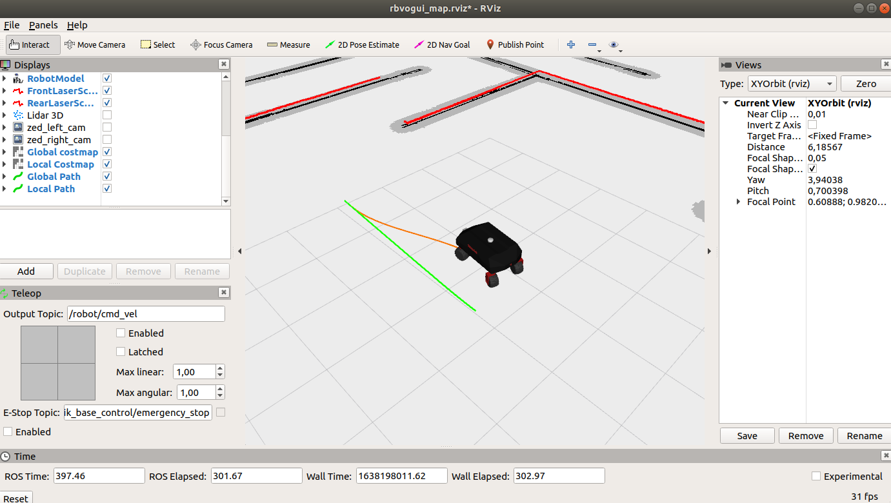
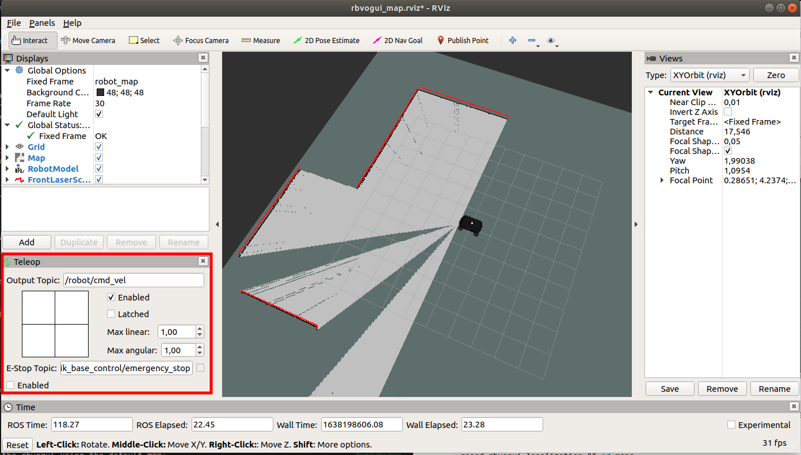
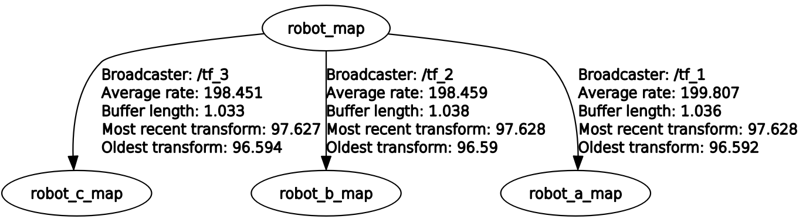
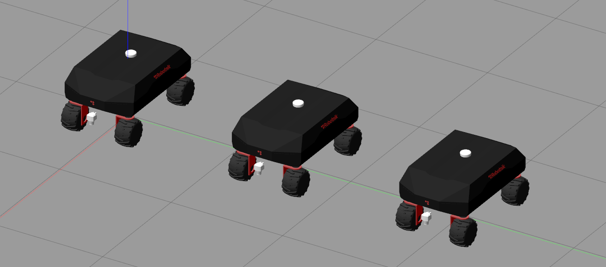
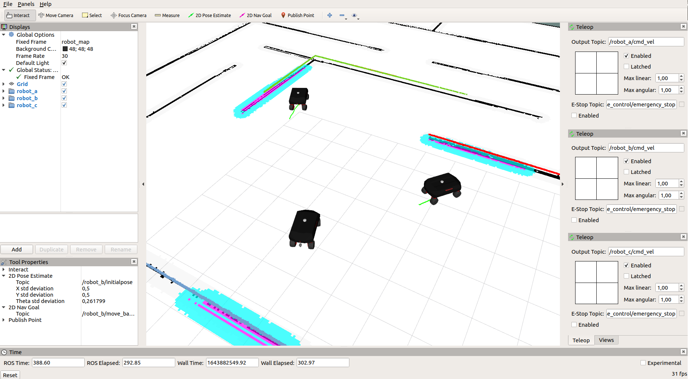
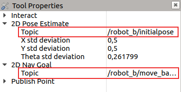
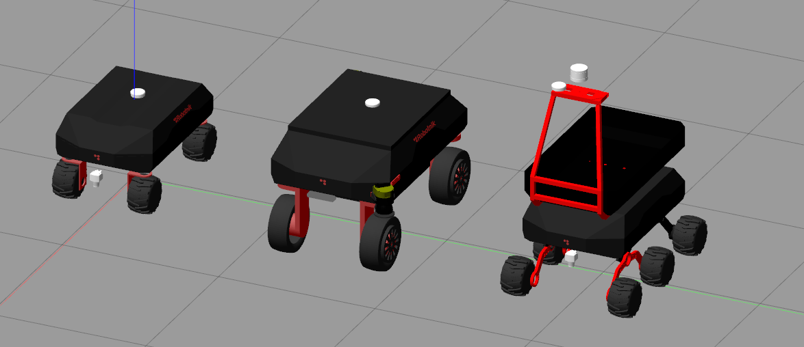
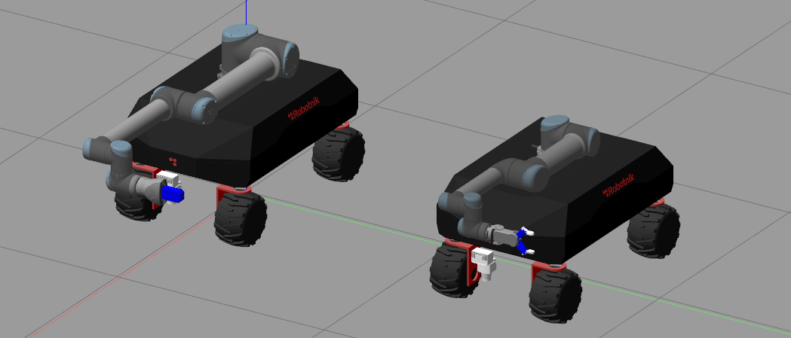
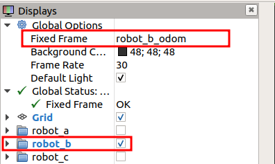

# inmerbot_sim

Packages for the simulation of the RB-Vogui

<p align="center">
  
  
</p>

## Paquetes

Este paquete contiene: 

### rbvogui_sim

Contiene todos los archivos necesarios para lanzar la simulación completa del modelo del RBVogui dedicado al proyecto INMERBOT

### rbvogui_common

Contiene los archivos necesarios para cargar los modelos del robot en el servidor de parámetros de ROS, además de las llamadas a los controladores.

## Requisitos

- Ubuntu 18.04
- ROS Melodic
- Python 2.7 o superior

## Simulando el RB-Vogui

### 1) Instalación de dependencias:

La simulación se ha testeadp usando Gazebo 11, para facilitar la instalación de los elementos que componen el repositorio usamos la herramienta ```vcstool```:

```bash
sudo apt-get install -y python3-vcstool
```

Instalamos ```catkin_tools``` para compilar el workspace

```bash
sudo sh -c 'echo "deb http://packages.ros.org/ros/ubuntu `lsb_release -sc` main" > /etc/apt/sources.list.d/ros-latest.list'
wget http://packages.ros.org/ros.key -O - | sudo apt-key add -
sudo apt-get update
sudo apt-get install python-catkin-tools
```

Instalamos ```rqt_joint_trajectory_controller``` para mover el brazo joint a joint y ```moveit_commander``` para moverlo vía script

```bash
sudo apt-get install ros-melodic-rqt-joint-trajectory-controller 
sudo apt-get install ros-melodic-moveit-commander
```

### 2) Crear un nuevo directorio de trabajo y clonar el repositorio:

Creamos un nuevo ws:

```bash
mkdir catkin_ws #Desde la carpeta que se quiera creamos el espacio de trabajo, como estándar catkin_ws
cd catkin_ws
```

Instalamos la versión estable del repositorio. Este repositorio se gestiona por medio de ramas. La rama principal, main, se considera la rama limpia y estable. Para nuevos desarrollos crearemos una nueva rama y realizaremos una pull request a la rama principal cuando hayamos terminado y comprobado los desarrollos.

**Instalamos la versión estable:**

```bash
vcs import --input https://raw.githubusercontent.com/RobotnikAutomation/inmerbot/main/repos/inmerbot.repos
rosdep install --from-paths src --ignore-src -y
``` 

### 3) Instalamos los paquetes propietarios de Robotnik, entre ellos: controladores, robotnik_msgs y rcomponent:


```bash
cd ~/catkin_ws
sudo dpkg -i src/rbvogui_common/libraries/*
```

### 4) Compilamos:

```bash
cd ~/catkin_ws
catkin build
source devel/setup.bash
```

### 5) Lanzamos la simulación:

Hay diferentes configuraciones disponibles:

- Vogui con manipulador UR-10
- Varios Voguis sin brazo

### 5.1 RB-Vogui con manipulador UR10

Para lanzar el rbvogui con el manipulador UR deberemos lanzar en terminal la siguiente llamada:
```bash
  roslaunch rbvogui_sim_bringup rbvogui_complete.launch robot_model:=rbvogui robot_xacro:=rbvogui_std_ur10.urdf.xacro launch_arm:=true arm_manufacturer:=ur arm_model:=ur10
```

<p align="center">
  
</p>

You can play with the arm by using the rqt_joint_trajectory:
```bash
ROS_NAMESPACE=robot rosrun rqt_joint_trajectory_controller rqt_joint_trajectory_controller
```

Or even use moveit to plan trajectories:
```bash
ROS_NAMESPACE=robot roslaunch rbvogui_moveit_ur10 demo.launch
```

<!-- 
### 6) Enjoy!

You can use the topic ```/robot/robotnik_base_control/cmd_vel ``` to control the RB-Vogui robot. -->

### 5.2 Varios Voguis sin brazo

*******************************
*****Zona en construcción******
*******************************

## 6) Teleoperación

El robot se puede controlar de tres maneras:

- Rviz pad plugin
- Keyboard
- Joystick

### 6.1 Rviz pad plugin

Cuando lanzamos RViZ a través de la simulación, el plugin se carga automáticamente. Lo encontramos en la esquina inferior izquierda de la pantalla de RViZ.

<p align="center">
  
</p>

### 6.2 Teclado

Instalamos el nodo para control por teclado

```bash
sudo apt-get update
sudo apt-get install ros-melodic-teleop-twist-keyboard
```

Abrimos una nueva termianl y lanzamos el nodo:

```bash
ROS_NAMESPACE=robot rosrun teleop_twist_keyboard teleop_twist_keyboard.py 
```

### 6.3 Joystick

El robot puede ser controlado con el mando de la PS4, este es el método habitual de control manual de los robots desarrollados por Robotnik, también disponemos de integración para simulación.

Seguir la guía de instalación: [guía de instalación del pad de robotnik](https://github.com/RobotnikAutomation/robotnik_pad)

Una vez tengamos todo instalado, lanzamos la simulación con ```launch_pad:=true```

Parámetro | Tipo | Descripción | Requisitos
------------ | -------------  | ------------- | -------------
launch_pad | booleano  | Lanza el paquete de robotnik pad | ds4drv installado, ps4 joystick, conexión bluetooth

Por ejemplo:

```bash
roslaunch rbvogui_sim_bringup rbvogui_complete.launch robot_model:=rbvogui launch_pad:=true
```

## 7) Mappping, localización y navegación

Con cualquiera de las anteriores configuraciones del robot podemos usar las siguientes acciones: **Solo añadiendo los siguiente parámetros:**


_______________________________________________________________________________________________________________________________________________________


Param | Tipo | Descripción | Requisitos
------------ | -------------  | ------------- | -------------
run_mapping | Boolean  | Launch gmapping mapping | Localization can not be running
run_localization | Boolean  | Launch amcl localization. | Mapping can not be running.
map_file | String | Set the map for localization | Format: map_folder/map_name.yaml
run_navigation | Boolean  | Launch TEB navigation | Localization must be running. Not compatible with mapping

### 7.1 Quick start

Launch a rbvogui with a default world and map for the localization and navigation

```bash
roslaunch rbvogui_sim_bringup rbvogui_complete.launch robot_model:=rbvogui robot_xacro:=rbvogui_std.urdf.xacro run_localization:=true run_navigation:=true
```

<p align="center">
  
</p>

### 7.2 Create a map

Launch rbvogui robot with gmapping:

```bash
roslaunch rbvogui_sim_bringup rbvogui_complete.launch robot_model:=rbvogui robot_xacro:=rbvogui_std.urdf.xacro run_mapping:=true rviz_config_file:=rviz/rbvogui_map.rviz
```

Move the robot by using the pad teleop plugin from rviz:

<p align="center">
  
</p>

When the map is fine, open a terminal and go to the ```rbvogui_localization``` package

```bash
cd ~/catkin_ws && source devel/setup.bash
roscd rbvogui_localization && cd maps
```

Create a folder with the name of the map. For example:

``` bash
mkdir demo_map
cd demo_map
```

Finally, save the map inside that folder

```bash
ROS_NAMESPACE=robot rosrun map_server map_saver -f demo_map
```


### 7.3 Use a map

Navigate with the rbvogui using the default map:

```bash
roslaunch rbvogui_sim_bringup rbvogui_complete.launch robot_model:=rbvogui robot_xacro:=rbvogui_std.urdf.xacro run_localization:=true run_navigation:=true
```

Or use your own map:

```bash
roslaunch rbvogui_sim_bringup rbvogui_complete.launch robot_model:=rbvogui robot_xacro:=rbvogui_std.urdf.xacro run_localization:=true run_navigation:=true map_file:=demo_map/demo_map.yaml
```

### 7.4 Troubleshooting

### 7.4.1  Laser visualization

If the laser does not display via RVIZ is probably because the computer does not use the GPU. You can disable the GPU for the rbvogui simulation. Just add this parameter to the robot:

```bash
roslaunch rbvogui_sim_bringup rbvogui_complete.launch robot_model:=rbvogui use_gpu:=false
```

## 8) Scripts

**Disclaimer**: **these examples have only been tested in the simulation. They work with the real robot but have been simplificated, therefore the security is not managed. For the real robot you must use the robot_local_control package.**

The robot can be commanded from a script via the standard ROS interface like move_base or moveit_commander.

### 1. Move robot script

Launch the robot, localization and navigation

```bash
roslaunch rbvogui_sim_bringup rbvogui_complete.launch robot_model:=rbvogui run_localization:=true run_navigation:=true
```

Then, run the script. The robot will move to (1,1) position

```bash
ROS_NAMESPACE=robot rosrun rbvogui_gazebo move_robot.py
```

You can set your own position by editing the script:

```bash
point.target_pose.pose.position.x = 1.0
point.target_pose.pose.position.y = 1.0
point.target_pose.pose.position.z = 0.0
```

### 2. Move arm script

Launch the robot with the arm:
```bash
  roslaunch rbvogui_sim_bringup rbvogui_complete.launch robot_model:=rbvogui robot_xacro:=rbvogui_std_ur10.urdf.xacro launch_arm:=true arm_manufacturer:=ur arm_model:=ur10
```

Launch moveit:
```bash
ROS_NAMESPACE=robot roslaunch rbvogui_moveit_ur10 demo.launch
```

Then run one of these scripts:

#### Joint by joint 

It moves the arm joint by joint

```bash
ROS_NAMESPACE=robot rosrun rbvogui_gazebo move_arm_joint_by_joint.py
```

You can set your own joints positions by editing the script:

```bash
joint_goal[0] = 0
joint_goal[1] = -pi/4
joint_goal[2] = 0
joint_goal[3] = -pi/2
joint_goal[4] = 0
joint_goal[5] = pi/3
```

#### To point

It moves the arm to a point

```bash
ROS_NAMESPACE=robot rosrun rbvogui_gazebo move_arm_to_point.py
```

You can set your own point by editing the script:
```bash
pose_goal.orientation.w = 1.0
pose_goal.position.x = 0.7
pose_goal.position.y = 0.4
pose_goal.position.z = 1.5
```

<!--
https://answers.gazebosim.org//question/12723/gpu_ray-sensors-bad-behaviour-when-increasing-samples/
-->

## 9) Multiple robots

### 9.1 Limitations

Simulating several robots at the same time in Gazebo is a complex task since it requires a powerful computer and a good structure of robots. These are the current limitations:

1. Simulation only works without GPU. The GPU plugin of the lidar laser in different robots at the same time leads to ```gazebo malloc(): memory corruption``` error in Gazebo.

2. In robots with arms, the robots must be the same model. Otherwise it leads to ```gazebo malloc(): memory corruption``` error in Gazebo. For example, two rbvoguis xl with arm and a rbvogui work, but two rbvoguis xl with arm and a rbvogui with arm do not work.

3. The moveit packages of the arms does not support multiple robots directly. The reason is that setup_assistant of Moveit does not take into account the prefix on frames and collisions. These packages were created for ```robot_``` prefix, but with multiple robots it changes to ```robot_a_```, ```robot_b_```, ```robot_c_``` .

### 9.2 Spawn

The following points are examples of the multi robot simulation. They can be combined with other configurations keeping in mind the limitations explained before.

Param | Type | Description |  Requirements
------------ | -------------   | ------------ | ------------
link_map | boolean  | Link the robot maps using a static transformation. Useful to control all robots from rviz when localization is working. | Multiple robots enabled, localization launched 

<p align="center">
  
</p>


### a) Launch three rbvogui with localization and navigation

```bash
roslaunch rbvogui_sim_bringup rbvoguis_complete.launch link_maps:=true run_localization_a:=true run_navigation_a:=true run_localization_b:=true run_navigation_b:=true run_localization_c:=true  run_navigation_c:=true
 ```
<p align="center">
  
</p>

robot_a |   | robot_b |   | robot_c |   |
--------| - | ------- | - | --------| - |
run_robot_a | true | run_robot_b | true | run_robot_c | true 
robot_model_a | rbvogui | robot_model_b | rbvogui | robot_model_c | rbvogui 
robot_xacro_a | rbvogui_std.urdf.xacro | robot_xacro_b | rbvogui_std.urdf.xacro | robot_xacro_c | rbvogui_std.urdf.xacro
run_localization_a | true  | run_localization_b  | true | run_localization_c  | true 
run_navigation_a | true  | run_navigation_b| true | run_navigation_c| true

From rviz, use the pad_teleop of each robot to control them or set a navigation goal to navigate autonomously.

<p align="center">
  
</p>

From the Tool Properties panel, change the ```2D Pose Estimate``` and ```2D Nav Goal``` topic to the namespace of the robot which will receive initalposes and goals .

<p align="center">
  
</p>

### b) Launch a rbvogui, a rbvogui xl and a rbvogui 6w with localization and navigation
 
```bash
roslaunch rbvogui_sim_bringup rbvoguis_complete.launch link_maps:=true  robot_model_a:=rbvogui robot_xacro_a:=rbvogui_std.urdf.xacro run_localization_a:=true run_navigation_a:=true robot_model_b:=rbvogui_xl robot_xacro_b:=rbvogui_xl_std.urdf.xacro run_localization_b:=true run_navigation_b:=true robot_model_c:=rbvogui_6w robot_xacro_c:=rbvogui_6w_std.urdf.xacro run_localization_c:=true run_navigation_c:=true
```

<p align="center">
  
</p>


robot_a |   | robot_b |   | robot_c |   |
--------| - | ------- | - | --------| - |
run_robot_a | true | run_robot_b | true | run_robot_c | true 
robot_model_a | rbvogui | robot_model_b | rbvogui_xl | robot_model_c | rbvogui_6w 
robot_xacro_a | rbvogui_std.urdf.xacro | robot_xacro_b | rbvogui_xl_std.urdf.xacro | robot_xacro_c | rbvogui_6w_std.urdf.xacro
run_localization_a | true  | run_localization_b  | true | run_localization_c  | true 
run_navigation_a | true  | run_navigation_b| true | run_navigation_c| true

<br/>

### c) Launch a rbvogui with UR-10 arm and EGH gripper and rbvogui with UR-5e arm and RG2 gripper

```bash
roslaunch rbvogui_sim_bringup rbvoguis_complete.launch robot_model_a:=rbvogui robot_xacro_a:=rbvogui_std_ur10_egh.urdf.xacro launch_arm_a:=true arm_manufacturer_a:=ur arm_model_a:=ur10 launch_gripper_a:=true gripper_manufacturer_a:=schunk gripper_model_a:=egh robot_model_b:=rbvogui robot_xacro_b:=rbvogui_std_ur5_rg2.urdf.xacro launch_arm_b:=true arm_manufacturer_b:=ur arm_model_b:=ur5 launch_gripper_b:=true gripper_manufacturer_b:=onrobot gripper_model_b:=rg2 run_robot_c:=false
```

<p align="center">
  
</p>


robot_a |   | robot_b |   | robot_c |   |
--------| - | ------- | - | --------| - |
run_robot_a | true | run_robot_b | true | run_robot_c | false 
robot_model_a | rbvogui | robot_model_b | rbvogui | robot_model_c | ---- 
robot_xacro_a | rbvogui_std_ur10_egh.urdf.xacro | robot_xacro_b | rbvogui_std_ur5_rg2.urdf.xacro | robot_xacro_c | ----
launch_arm_a | true | launch_arm_b | true | launch_arm_c | ----
arm_manufacturer_a | ur | arm_manufacturer_b | ur | arm_manufacturer_c | ----  
arm_model_a | ur10 | arm_model_b | ur10 | arm_model_c | ----
launch_gripper_a | true | launch_gripper_b | true | launch_gripper_c | ----
gripper_manufacturer_a | schunk | gripper_manufacturer_b | onrobot | gripper_manufacturer_c | ----  
gripper_model_a | egh | gripper_model_b | egh | gripper_model_c | ----


Since this example is launched without localization and navigation, the default fixed frame is ```robot_a_odom```. Change the fixed frame to the robot namespace and enable its folder on rviz.

<p align="center">
  
</p>

### d) Launch a rbvogui xl with UR-10e arm and ewellix lift and rbvogui xl with two UR10e 

```bash
roslaunch rbvogui_sim_bringup rbvoguis_complete.launch robot_model_a:=rbvogui_xl robot_xacro_a:=rbvogui_xl_lift_ur10e.urdf.xacro launch_arm_a:=true arm_manufacturer_a:=ur arm_model_a:=lift_ur10e robot_model_b:=rbvogui_xl robot_xacro_b:=rbvogui_xl_std.urdf.xacro launch_arm_b:=true arm_manufacturer_b:=ur arm_model_b:=bi_ur10e  run_robot_c:=false 
```

<p align="center">
  
</p>

robot_a |   | robot_b |   | robot_c |   |
--------| - | ------- | - | --------| - |
run_robot_a | true | run_robot_b | true | run_robot_c | false 
robot_model_a | rbvogui_xl | robot_model_b | rbvogui_xl | robot_model_c | ---- 
robot_xacro_a | rbvogui_xl_lift_ur10e.urdf.xacro | robot_xacro_b | rbvogui_xl_std.urdf.xacro | robot_xacro_c | ----
launch_arm_a | true | launch_arm_b | true | launch_arm_c | ----
arm_manufacturer_a | ur | arm_manufacturer_b | ur | arm_manufacturer_c | ----  
arm_model_a | lift_ur10e | arm_model_b | bi_ur10e | arm_model_c | ----

Tha arms can be controlled joint by joint by using the ```rqt_joint_trajectory``` plugin.  Set the namespace depending on the robot selected.

```
ROS_NAMESPACE=robot_a rosrun rqt_joint_trajectory_controller rqt_joint_trajectory_controller
```

```
ROS_NAMESPACE=robot_b rosrun rqt_joint_trajectory_controller rqt_joint_trajectory_controller
```

## Docker usage

In order to run this simulation you will need nvidia graphical accelation

### Installation of required files
- [docker](https://docs.docker.com/engine/install/ubuntu/)
- [nvidia-docker](https://docs.nvidia.com/datacenter/cloud-native/container-toolkit/install-guide.html#docker)
- nvidia-drivers

### Usage

```bash
git clone https://github.com/RobotnikAutomation/rbvogui_sim.git
cd rbvogui_sim
git checkout melodic-devel
docker/simulation-in-container-run.sh
```

#### Selecting the robot model

You can select the robot, the launch file of package using the optional arguments on launch
By default the selected robot is `rbvogui`

```bash
docker/simulation-in-container-run.sh --help
```

```
ROBOTNIK AUTOMATION S.L.L. 2021

Simulation of RB VOGUI using docker

Usage:
docker/simulation-in-container-run.sh [OPTIONS]

Optional arguments:
 --robot -r ROBOT       Select robot to simulate
                        Valid robots:
                            rb_vogui_one_ur_arm rb_vogui_xl_two_ur_arms rb_vogui rb_vogui_xl
                        default: rb_vogui

 --launch -l            Select launch file
                        default: rbvogui_complete.launch kinematics:=omni twist2ackermann:=false

 --package -p           Select ros package
                        default: rbvogui_sim_bringup

 --ros-port -u PORT     Host ros port
                        default: 11345

 --gazebo-port -g PORT  Host ros port
                        default: 11345

 -h, --help             Shows this help

```

**RB Vogui with one UR arm**
```bash
docker/simulation-in-container-run.sh --robot rb_vogui_one_ur_arm
```
***IMPORTANT:*** This simulation starts paused, please remember to press play button on gazebo after few seconds

**RB Vogui XL**
```bash
docker/simulation-in-container-run.sh --robot rb_vogui_xl
```
***IMPORTANT:*** This simulation starts paused, please remember to press play button on gazebo after few seconds

**RB Vogui XL with UR arms**
```bash
docker/simulation-in-container-run.sh --robot rb_vogui_xl_two_ur_arms
```
***IMPORTANT:*** This simulation starts paused, please remember to press play button on gazebo after few seconds

#### Manual Build

If you wish to build manually the image without the use of the script use one the following commands:

**Optiona A**
```bash
cd docker
docker build -f Dockerfile ..
```
**Option B**
```bash
docker build -f docker/Dockerfile .
```

#### Notes

- This is docker requires a graphical interface
- The ros master uri is accesible outside the container, so in the host any ros command should work
- You could also run a roscore previous to launch the simulation in order to have some processes on the host running
- if you want to enter on the container use the following command in another terminal
```bash
docker container exec -it rb_vogui_sim_instance bash
```
- In order to exit you have to 2 options
1. Close `gazebo` and `rviz` and wait a bit
2. execute in another terminal:
```bash
docker container rm --force rb_vogui_sim_instance
```
